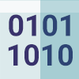

# Base32Crockford

[](https://dev.azure.com/askalione/OpenSource/_build?definitionId=2)
[](https://github.com/askalione/base32-crockford-net/blob/master/LICENSE)

This package is .NET number (`UInt64`) encoder/decoder implementation of [Base32 Crockford](https://www.crockford.com/base32.html) inspired by [jbittel's Python package](https://github.com/jbittel/base32-crockford). 

Key features:

* Encode/Decode `UInt64` number (from 0 to 18,446,744,073,709,551,615);
* Uses a symbol set of 10 digits and 22 uppercase. Letter «U» is excluded, letters «I» and «L» are treated the same as 1 and «O» is treated the same as 0;
* Optional check symbol on the end;
* Optional splitting to symbol chunks (symbol «-» is delimiter).

Examples:

| Number | Encoded string | Encoded string with check symbol |
| --- | --- | --- |
| 1 | 1 | 11 |
| 1337 | 19S | 19S5 |
| 63242 | 1XRA | 1XRA9 |
| 98231234 | 2XNRY2 | 2XNRY28 |
| 49278356408124 | 1CT61EVHSW | 1CT61EVHSWZ |
| 18446744073709551615 | FZZZZZZZZZZZZ | FZZZZZZZZZZZZB |

## Install

.NET CLI:
```
dotnet add package Base32Crockford
```

Package Manager Console:
```
Install-Package Base32Crockford
```

## Usage

```cs
Base32CrockfordEncoding encoding = new Base32CrockfordEncoding();

// Encode
string encodedString = encoding.Encode(1337); // Result: "19S"
// Encode with check symbol on the end of result string.
string encodedString = encoding.Encode(1337, checksum: true); // Result: "19S5"
// Encode with check symbol on the end of result string.
string encodedString = encoding.Encode(133777345, split: 2); // Result: "3ZJ-HY1"

// Decode
ulong number = encoding.Encode("19S"); // Result: 1337
// Decode with check symbol
ulong number = encoding.Encode("19S5"); // Result: 1337
```

Singleton lifetime:

```cs
Base32CrockfordEncoding.Current.Encode(1337); // Result: "19S"
```


## License

Base32Crockford is open source, licensed under the [MIT License](https://github.com/askalione/base32-crockford-net/blob/master/LICENSE).